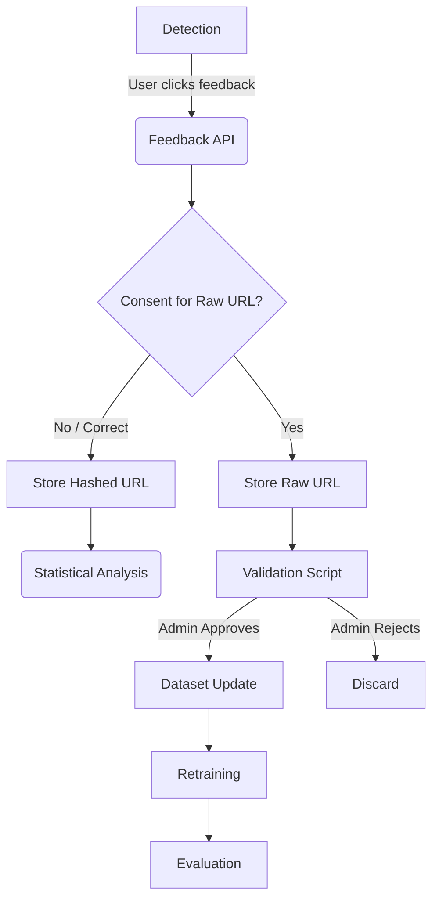

# Feedback and Dataset Improvement Pipeline

PhishGuard employs a human-in-the-loop lifecycle for processing user feedback to improve the machine learning model. To preserve privacy while enabling continuous improvement, the pipeline is explicitly decoupled from automatic deployment.

## Pipeline Architecture

## 1. Detection & Feedback
When PhishGuard evaluates a URL, the user is presented with the prediction and an option to submit feedback (👍 Correct, 👎 Safe, 🚨 Malicious).

## 2. Privacy Check & Storage
- If a user submits a "False Positive" or "False Negative", they are asked if they consent to sharing the raw URL.
- If they consent, the raw URL is stored in `data/feedback.csv`.
- If they decline (or if the prediction was just marked "Correct"), the URL is hashed using SHA-256 before storage to protect privacy. Hashed URLs are used purely to calculate real-world accuracy rates, not for training.

## 3. Validation
Administrators run `scripts/process_feedback.py`. This interactive CLI tool:
1. Filters out hashed URLs (since they cannot be manually verified).
2. Presents each raw URL and the user's claim (e.g. "User claims this is Safe").
3. Asks the administrator to manually verify the site and Accept/Reject the claim.

## 4. Dataset Update
If the administrator accepts the feedback, the URL is appended to the main training dataset (`data/training_urls.csv`) with the corrected label. 
To prevent data corruption, the script creates a time-stamped version of the dataset (e.g. `training_urls_v_20260822_120000.csv`) before overwriting the active dataset.

## 5. Retraining and Evaluation
The model is **never** retrained or deployed automatically. When enough new verified data has been collected, administrators run `scripts/train_model.py` to produce a new model artifact. The new model is evaluated using the benchmark scripts before being pushed to production.
